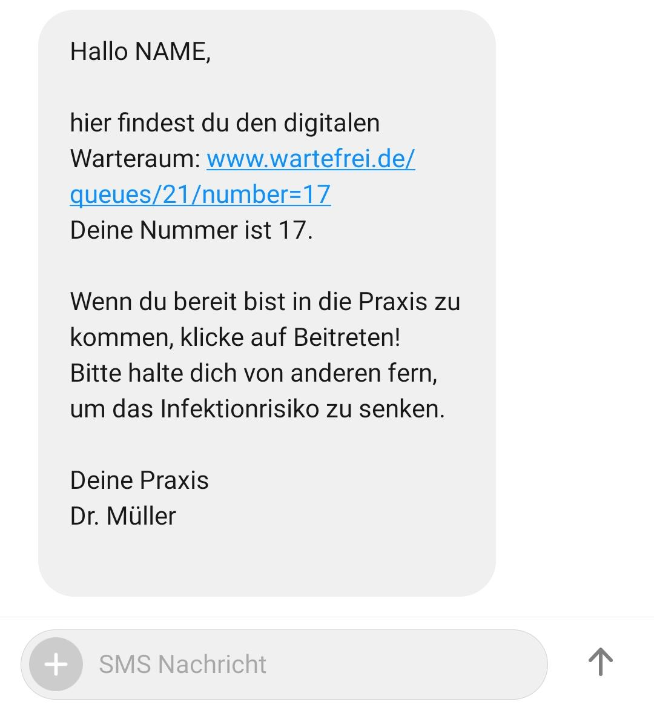

# Digital Waitingroom

- [Digital Waitingroom](#digital-waitingroom)
  - [Motivation|Idea](#motivationidea)
  - [User Stories](#user-stories)
    - [Emergency visit without appointment](#emergency-visit-without-appointment)
    - [Scheduled appointment](#scheduled-appointment)
  - [Minimum Viable Product](#minimum-viable-product)
    - [Additional Features](#additional-features)
  - [Open Questions](#open-questions)
  - [Project Architecture](#project-architecture)
  - [TODOs](#todos)

## Motivation|Idea

Develop the digital waiting room!

This product would tackle the problem of crowded waiting rooms and the therefrom arising problems like risk of infection and patient throughput bottlenecks. Also, we would contribute to reducing the staggering 9000+ hours of patient management in a 800 bed hospital.

The goal is to develop a progressive web app, which acts as a interface between clinical staff and the patient. The most important feature is the live-update of the queue position. Using this estimate, the patient can get a feeling for how long his wait will be and spend this time outside.

Find the current patient UI design draft at [our figma page](https://www.figma.com/file/NUWYQQ6T5zKVLng4IAdxSJ/digital-waiting?node-id=0%3A1).

## User Stories

These two user stories exemplary show our envisioned use of the application.

### Emergency visit without appointment

1. Calls doctors office and requests direct treatment
2. Receptionist enters new patient user profile
   1. (appointment time --> now)
   2. Full Name
   3. Short diagnosis --> emergency/acute
   4. mobile number
3. Patient receives SMS with link to personal digital waiting room
4. Travel to areas of doctors office (outside waiting area or personal car)
5. Enter waiting room by clicking Button on welcome page
6. App displays number of patients in front of you, estimated time and waiting number
7. When doctor is ready, receptionist clicks on "call patient"
8. Patient view changes to "Bitte in die Praxis kommen"

### Scheduled appointment

1. Calls doctors office and requests treatment
2. Receptionist enters new patient user profile
   1. Checks calendar ->appointment->25.05.2020,12:30
   2. Full Name
   3. Short diagnosis
   4. Mobile number
3. Patient receives SMS with link to personal digital waiting room
4. Several days in advance:

   ```text
   Hallo
   Ihr Termin ist am
   25.05.2020
   um 12:30
   ```

5. The same day

   ```text
   Hallo
   Sie haben ihren Termin heute
   um 12:30 bei Dr.Meier

   Die Aktuelle Wartezeit beträgt heute:
   15min
   ```

6. 30 Minutes before the appointment-> possible to check into queue

   ```text
   Hallo
   Sie haben ihren Termin heute
   um 12:30 bei Dr.Meier

   Die Aktuelle Wartezeit beträgt heute:
   15min

   Bitte klicken sie auf diesen Knopf um in die Wartelschlange aufgenommen zu werden, falls es ihnen Möglich ist in den nächsten '15min' in der Praxis einzutreffen
   ```

7. Travel to areas of doctors office (outside waiting area or personal car)
8. Enter waiting room by clicking Button on welcome page
9. App displays number of patients in front of you,waiting number, and updated estimated waiting time
10. When doctor is ready, receptionist clicks on "call patient"
11. Patient view changes to "Bitte in die Praxis kommen"

This is how the sms could look like:



## Minimum Viable Product

One waiting queue per doctors office. The welcome page can be accessed with the placeID appended to the base url. E.g.:

`digitalwaiting.de/UK-Erlangen`

- back-end
  - functionalities:
    - store patient pseudonyms, waiting number and status (waiting, called, done)
    - return waiting position when given the waiting number
    - secure REST-Api calls (auth, encryption)
    - delete all patients at end of day
- front-end
  - admin
    - functionalities:
      - enter a new queue entry (name or pseudonym)
      - notify a patient (set patient status on called)
      - delete patient from queue
  - patient
    - functionalities:
      - show waiting number
      - show doctors office name (and image?)
      - show number of patients in front you
      - notification when called

### Additional Features

- Multiple queues (corona, emergency, normal) or (Dr. Maier, Dr. Schmidt)
- Estimate waiting time based on moving average
- Enable a primitive form of patient-receptionist communication (confirm proximity button @ patient front-end)
- Integrate with scheduling tool and appointment tool
- Digitally Edit and Send the 'preexisting conditions' form

## Open Questions

- Active patient front-end polling or backend-initiated push notification?
- Encryption (serverside, front-end key in session token?)
- How does the patient get to the queue page?
  - Receive Waiting Room ID and personal Waiting Room #
  - Receive A Mail/SMS Upon registration at the front desk via phone
  - Sign in to doctors office completely remote?
    - select doctors office

## Project Architecture

This project is (as outlined before) structured into backend and front end. The used software stack is described in [Architecture](architecture.md).

There is one flask-based webserver, which exposes the administrative functionality of the project via a REST-Api. The sources for these backend functions can be found in the folder `./backend`.

The client side of the application was written using React. The code can be seen in the folder called `./frontend`.

## TODOs

- remove data from admin-frontend and pull from backend
- css for admin frontend
